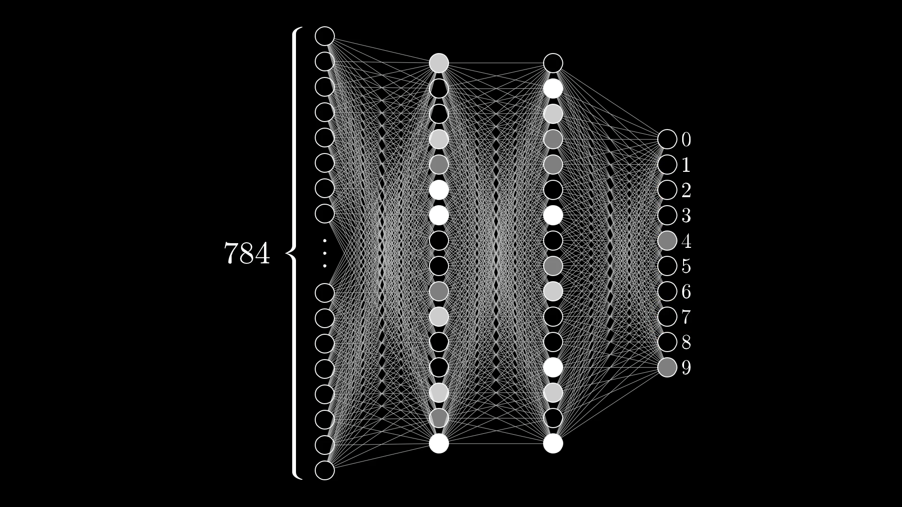
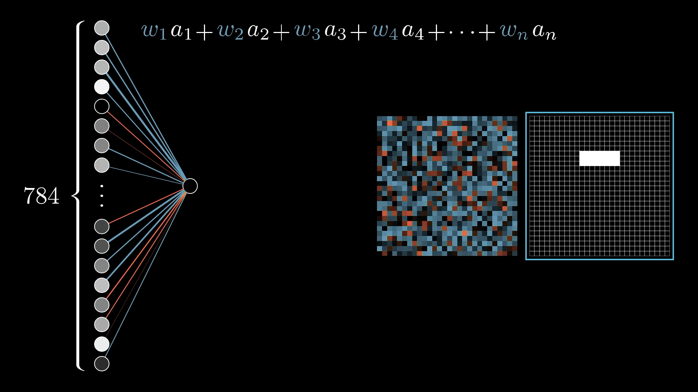
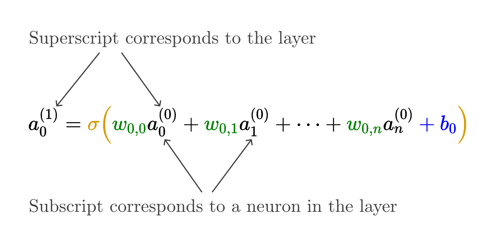

# Chapter 1
## 1.Neurons  
A thing that holds a **number**.  
>number:activation  

Create a layer of 784 neurons, where each neuron corresponds to a particular pixel.  
The number of ouput neurons is equal to the classes.  
 ## 2.Hidden Layers
A full connected network which has two hidden layers.   
 
When we human recognize numbers we may break them into parts,for example 9 is a **combination** of a circle and a line.  
We might hope that each neuron in the second-to-last layer corresponds to one of these subcomponents.
## 3.Information pass between layers
The layers break a complicate problem into bite-sized pieces.Bying doing so we can simplify the recognition problem by adding more layers.  
In the full connected network every two neurons are linked by a weight **$\omega_n$** .So the total formula is:
$$\omega_1a_1+\omega_2a_2+\omega_2a_2+...+\omega_na_n$$

>We also add bias in the formula  
## 4.Formula
It’s common to pump this weighted sum into some function that squishes the real number line into the range between 0 and 1.  
A very popular function is **sigmoid**:
$$\sigma(x)=\frac{1}{1+e^{-x}}$$

We are more likely to use matrix language to describe this formula.  
## 5.Why choose ReLU?
It is more like a real human neuron and well trained in some deep network framework.