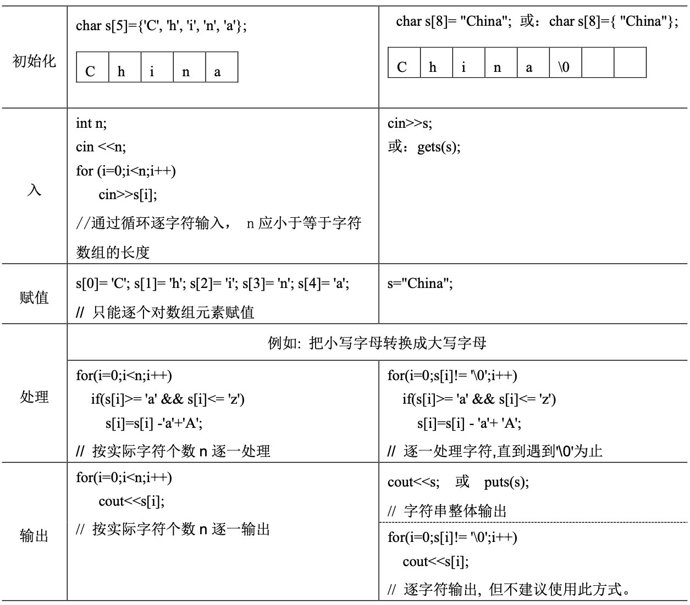

# C++ Semi Exam Note 
## 第 1 章 C/C++概述

### 正确命名标识符
- 下面的标识符则**不合法**  
`2A` `A-B` `area of circle` `M.D` `int`  
---
### 关于输入运算符
- “>>”称为输入运算符，也称为提取运算符
- 各变量可以是任意数据类型，输入时各个数据之间用空格、TAB键或回车分隔。
---

---
### 包含头文件两种方式:
- 用尖括号`<>`时，预处理程序在系统指定的文件夹中寻找
- 用双引号`""`时，预处理程序首先在当前文件所在的文件目录中寻找，若找不到才到系统指定的文件夹中查找
---
### VisualStudio工程文件树⬇

---
## 第 2 章 基本数据类型、运算符和表达式
### 定义的作用
- 程序中对各种数据处理之前首先要**定义**数据的类型，以便为这些数据分配存储空间，并明确它们可以进
行的运算。
---
### 数据类型⬇
  
---
### 初始化的两种方法👐:
- 形式1：数据类型 变量名=表达式  ex:`int a = 10;`
- 形式2：数据类型 变量名(表达式) ex:`int a(10);`
---
### 引用
- **引用**是一个虚拟变量，系统并不对其单独分配内存空间。
---
### 字符型常量📌  
- 字符型常量是用一对单引号引起来的单个字符。如：`'A'` `'b'` `'3'` `'+'` 等均为字符型常量，在机器内部是以字符的**ASCII**码存储的。
---
### 常见转义  

---
### 字符串和字符📌

---
### 符号常量的表示
- C/C++中可以用`const`关键字或`#define`命令定义符号常量。
---
### 关于`%`
- 求余数运算符`%`要求操作数必须都是整型数，其结果是两个整数相除以后得到的“整余数”。例如，`5%3` 的值为2。
---
### 前缀与后缀自增📌
- `j++` 等价于 `j=j+1`  
- `j--`等价于`j=j-1`
- 前置运算的执行过程是，**先使变量的值增加**1或减少1，然后再引用变量的值参与其它运算
- 后置运算的执行过程是，**先引用变量的值**，然后再将变量的值增加1或减少1
- ex:
    ```c++
    int j=5,k=5,m,n;
    m=j++; //相当于 m=j;j=j+1; 结果是j 的值为6，m 的值为 5
    n=++k; //相当于 k=k+1;n=k; 结果是 k 的值为 6，n 的值为 6
    ```
---
### 冷知识❗
- 赋值运算符的左端只能是**变量**，不能是**常量**或**表达式**
---
### 常见表达式的书写方式

---
### 类型转换🔁
- **自动类型转换**又称为隐式转换  
  1. 操作数为字符型或短整型(`short`)时，系统**自动**将它们转换成整型。
  2. ex：`'a'+'c'` 的结果是196，该运算是将两个字符的ASCII码值相加，结果为`int`类型。
  3. 转换优先级表：

- **强制类型转换**又称为显示转换
  1. 形式1：(数据类型)表达式
  2. 形式2：数据类型(表达式)
    ```c++
    float a=3.5,b=2.0; //则：(int)a*b 的值为6.0。
    int a=30,b=4;
    double x,y;
    x=(double)a/b;
    y=double(a/b); //运算结果：x 的值为7.5，y 的值为 7.0。
    ```
### 如何表示$x^y$
- `pow(x,y)` 计算$x^y$
---
## 第 3 章 基本控制结构
### 关于switch语句❗
- 当表达式的值非0(或`true`)时，执行`if`后面的语句，否则跳过这条语句，执行后面的内容。
- `switch`后面的表达式只能是**整型、字符型、布尔型**或**枚举**类型。
- **特别需要注意的是**❗，`float`或`double`类型的表达式不能出现在`switch`后面的表达式中。
- 常量表达式的类型应与`switch`后面的表达式的类型一致；常量表达式的值应互不相同，但不同的常量表达式可以共用同一个语句组。

---
### 两种`while`语句
```c++
while(表达式)
{}
```
```c++
do
{}
while (表达式);
```
- ❗与`while`语句不同，在`do-while`语句中的`while(表达式)`后面是有分号的。  
### `for`语句
```c++
for (表达式 1; 表达式2; 表达式3)
{}
```
- 执行逻辑❗❗❗

1. 计算`表达式1`，对循环变量进行初始化；
2. 判断`表达式2`，决定是否循环。若`表达式2`的值非0，则执行一次循环体语句，若其值为0(或false)，则**结束循环**。
3. 计算`表达式3`，改变循环变量的值，然后转回到第2.步重新判断循环条件
- 空语句：`for( ; ; )`
---
## 第 4 章 数组
### 产生$[0,100]$的随机数
```c++
 mark[i]=rand()% 101;
```
- 使用种子产生真随机数❗
```c++
 srand((unsigned)time(NULL));
```
- 使用系统函数`time`，需要配合文件包含命令：`#include <time.h>` 


 (1) int a[10]; a={1,3,5,7,9};
错误原因：不允许用赋值语句对数组名赋值，因为数组名是地址常量，不能被修改。


 (2) int a[10]; a[10]={1,3,5,7,9};
错误原因：赋值语句中的a[10]表示下标为10的元素，该数组的下标范围为0～9，数
组下标越界；同时给一个元素赋值也不允许出现由花括号括起的常数表。
(3) int c[3]={1,2, 3,4};
错误原因：花括号内的常量个数超过数组定义的长度。


 数组排序



